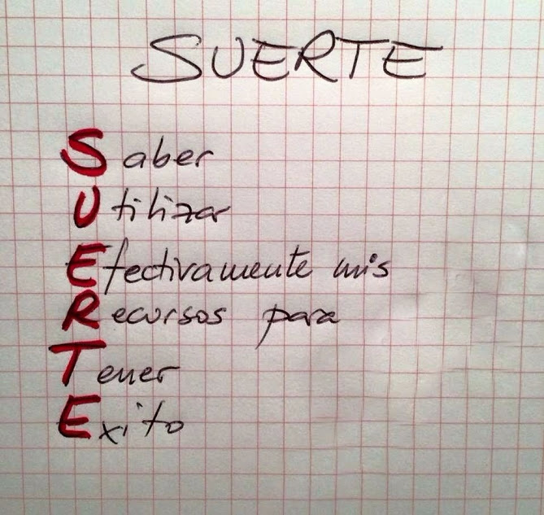

# Diplomado en Backen Junio 2021
Diplimado Programación BackEnd Junio 2021
## DESARROLLO BACK-END
### Hackaton Semana 2
#### Se requiere lo siguiente:

 - Crear nuestra propia pagina en GitHub

#### Se calificará de la siguiente manera
 - Tendrán la calificación menor a 12 las personas no cumplan las espectativas
 - Tendrán la calificación de 14 las personas que cumplan algunas espectativas
 - Tendrán la calificación de 16 las personas que cumplan todas las espectativas 
 - Tendrán la calificación de 20 las personas que superen las espectativas 

  
## Mucha suerte
